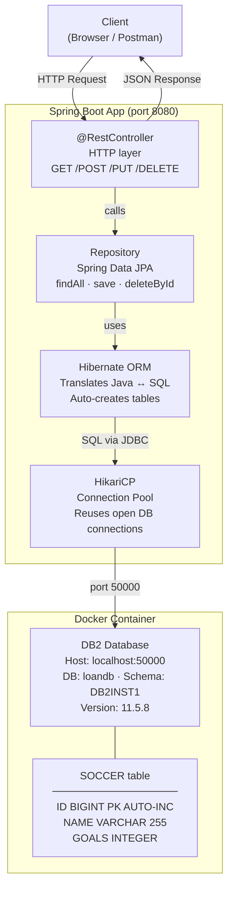
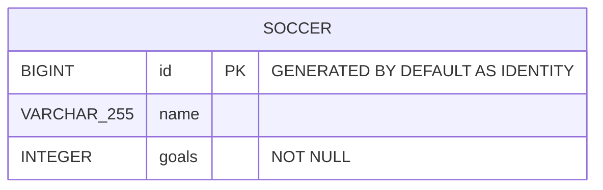

# Spring Boot + Hibernate + DB2 — How It All Works

---

## System Design Overview



---

## What Each Layer Does

### 1. @RestController — HTTP Layer
- Receives HTTP requests (GET, POST, PUT, DELETE)
- Maps URL paths to Java methods via `@GetMapping`, `@PostMapping`, etc.
- Returns data as JSON automatically

### 2. Repository — Data Access Layer
- `JpaRepository<Soccer, Long>` gives you free methods:
  - `findAll()` → SELECT * FROM soccer
  - `save(entity)` → INSERT or UPDATE
  - `deleteById(id)` → DELETE WHERE id = ?
  - `findById(id)` → SELECT WHERE id = ?
- You write zero SQL for basic operations

### 3. Hibernate — The ORM (Object-Relational Mapper)
- Translates your Java `@Entity` classes into database tables
- Runs the actual SQL against DB2
- Manages the connection lifecycle
- Caches queries for performance

### 4. HikariCP — Connection Pool
- Maintains a pool of open DB2 connections (reused across requests)
- Way faster than opening a new connection per request
- Spring Boot wires this in automatically

### 5. DB2 — The Database Server
- Runs inside Docker on your machine (port 50000)
- Stores data permanently on disk (survives app restarts)
- Speaks SQL via the JDBC protocol

---

## The DB2 Connection

### JDBC URL format
```
jdbc:db2://localhost:50000/loandb
          │         │      └── database name (set via DBNAME= in Docker)
          │         └───────── port (DB2 default)
          └─────────────────── host
```

### application.properties explained
```properties
# Where is DB2?
spring.datasource.url=jdbc:db2://localhost:50000/loandb

# Which Java class handles the DB2 protocol?
spring.datasource.driver-class-name=com.ibm.db2.jcc.DB2Driver

# DB2 credentials (set when you ran docker run)
spring.datasource.username=db2inst1
spring.datasource.password=password123

# Tells Hibernate what SQL "dialect" (flavor) to generate
# DB2 has slightly different syntax to MySQL/Postgres
spring.jpa.database-platform=org.hibernate.dialect.DB2Dialect

# Schema management strategy:
#   update      = add new columns/tables, never delete data (good for dev)
#   create-drop = wipe and recreate on every restart (dangerous — dev only)
#   validate    = only check schema matches, never change it (good for prod)
#   none        = do nothing, you manage schema yourself (prod standard)
spring.jpa.hibernate.ddl-auto=update

# Print every SQL statement Hibernate runs (turn off in prod)
spring.jpa.show-sql=true
```

### Docker command reference
```bash
docker run -itd \
  --name db2server \
  --platform linux/amd64 \   # needed on Apple Silicon (ARM) Macs
  --privileged=true \         # DB2 needs elevated permissions
  -p 50000:50000 \            # expose DB2 port to your Mac
  -e LICENSE=accept \         # accept IBM license
  -e DB2INST1_PASSWORD=password123 \  # sets db2inst1 user password
  -e DBNAME=loandb \          # creates this database on first run
  ibmcom/db2
```

---

## How Hibernate Maps Java → DB2



Each Java field maps to a DB2 column:

| Java | Annotation | DB2 Column |
|---|---|---|
| `class Soccer` | `@Entity` | `CREATE TABLE soccer` |
| `Long id` | `@Id @GeneratedValue` | `id BIGINT PK AUTO-INC` |
| `String name` | _(none needed)_ | `name VARCHAR(255)` |
| `int goals` | _(none needed)_ | `goals INTEGER NOT NULL` |

Hibernate ran this SQL automatically on first startup:
```sql
CREATE TABLE soccer (
    id    BIGINT GENERATED BY DEFAULT AS IDENTITY,
    goals INTEGER NOT NULL,
    name  VARCHAR(255),
    PRIMARY KEY (id)
)
```

---

## Reading the Startup Logs

```
HikariPool-1 - Added connection ...
```
Connection pool successfully connected to DB2. Your credentials and URL are correct.

```
HHH90000025: DB2Dialect does not need to be specified explicitly
```
Minor warning — Hibernate 7 can auto-detect DB2, so you don't need
`spring.jpa.database-platform` anymore. It still works either way.

```
Database version: 11.5.8
Default catalog/schema: undefined/DB2INST1
```
Connected to DB2 version 11.5.8. Your tables live in schema `DB2INST1`.

```
Hibernate: create table soccer (id bigint generated by default as identity, ...)
```
Hibernate auto-created the SOCCER table because `ddl-auto=update` and
the table didn't exist yet. Next restart it won't recreate it — just verify.

```
Started DemoApplication in 4.645 seconds
```
App is live at http://localhost:8080

---

## Key Concepts Summary

| Term | What it is |
|---|---|
| **JDBC** | Low-level Java standard for talking to any database |
| **JPA** | Higher-level standard — defines annotations like `@Entity`, `@Id` |
| **Hibernate** | The actual implementation of JPA (does the real work) |
| **Spring Data JPA** | Spring wrapper that gives you `JpaRepository` for free CRUD |
| **HikariCP** | Connection pool — reuses DB connections for performance |
| **DB2Dialect** | Tells Hibernate to generate DB2-compatible SQL syntax |
| **DDL** | Data Definition Language — `CREATE TABLE`, `ALTER TABLE`, etc. |
| **Schema** | A namespace inside a database — your tables live in `DB2INST1` |
