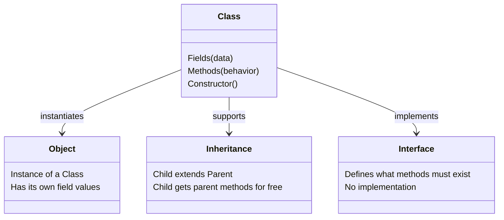
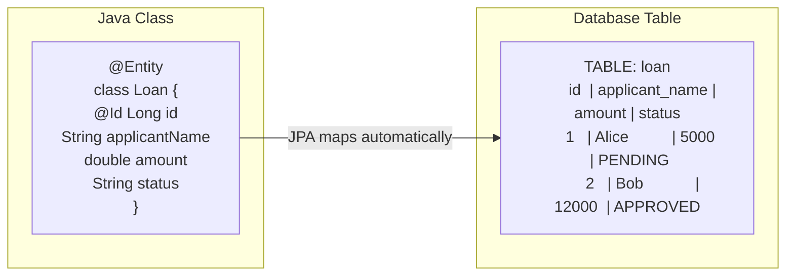
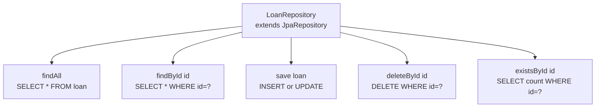
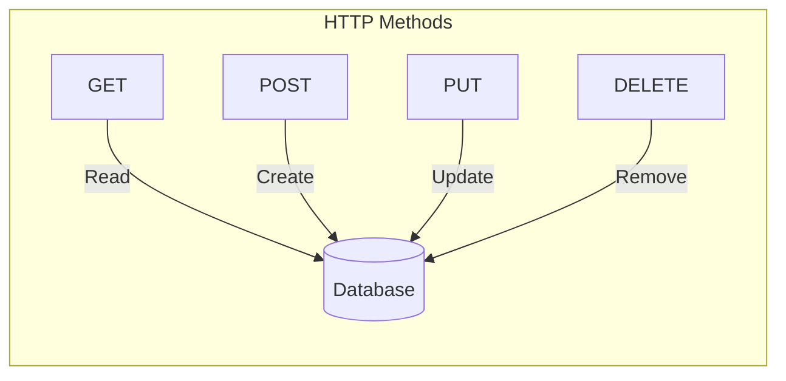
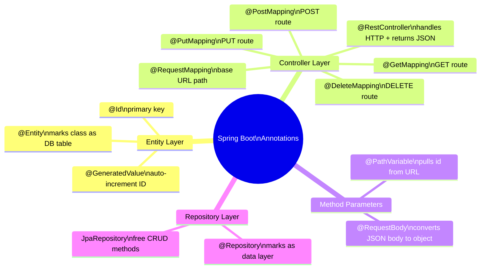
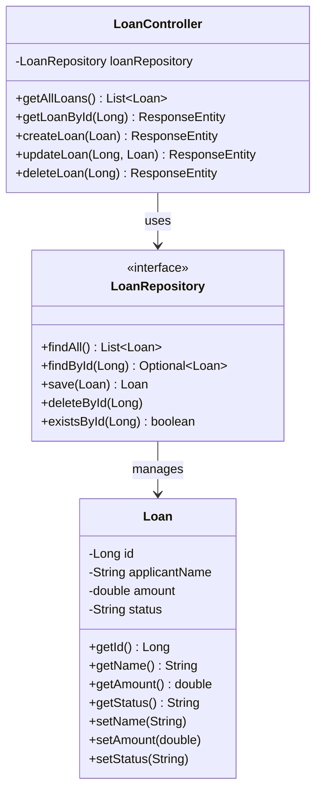

# Java + Spring Boot Concepts

## 1. Java OOP Basics



---

## 2. How a Spring Boot Request Flows

```mermaid
flowchart TD
    A[HTTP Request\ne.g. POST /loans] --> B[@RestController\nLoanController]
    B --> C[@Service / Business Logic\noptional layer]
    C --> D[@Repository\nLoanRepository]
    D --> E[(Database\nH2 / Postgres)]
    E --> D
    D --> C
    C --> B
    B --> F[HTTP Response\nJSON]
```

---

## 3. Spring Boot Layer Architecture

```mermaid
flowchart LR
    subgraph Controller Layer
        A[@RestController\nHandles HTTP\nReturns JSON]
    end

    subgraph Repository Layer
        B[@Repository / JpaRepository\nCRUD methods\nNo SQL needed]
    end

    subgraph Database Layer
        C[(H2 / Postgres\nActual data storage)]
    end

    subgraph Entity Layer
        D[@Entity\nMaps Java class\nto DB table]
    end

    A -->|calls| B
    B -->|reads/writes| C
    D -->|describes shape of| C
```

---

## 4. JPA — How @Entity Maps to a Table



---

## 5. JpaRepository — Free Methods



---

## 6. REST HTTP Methods



---

## 7. Annotations Cheat Sheet



---

## 8. OOP in This Project


